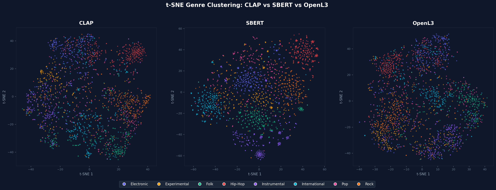
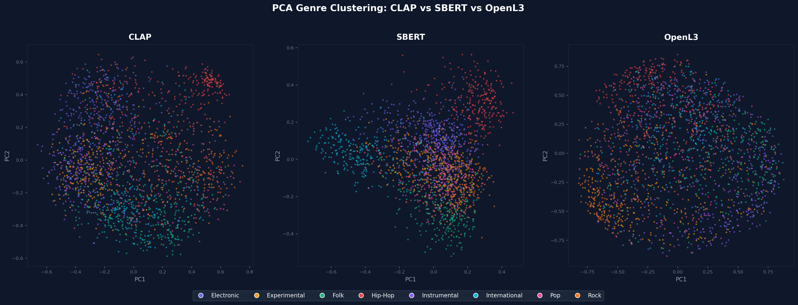
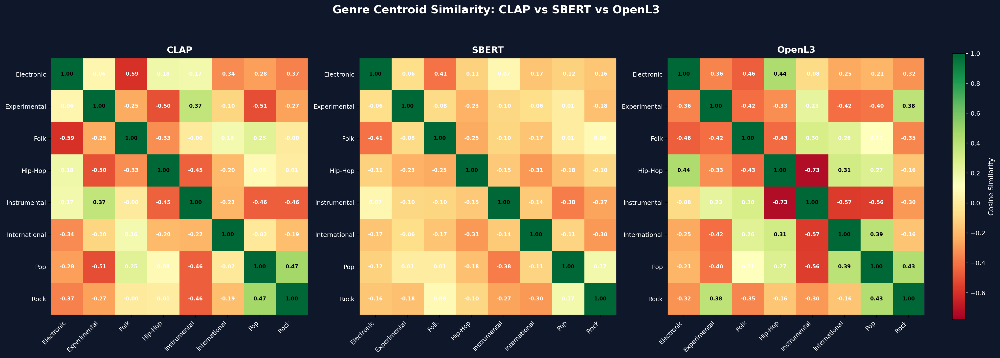
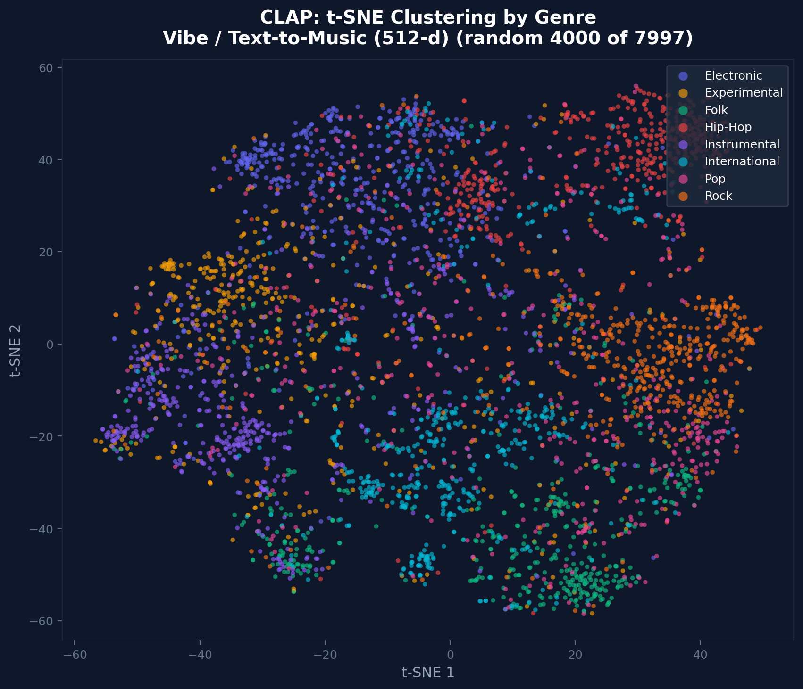
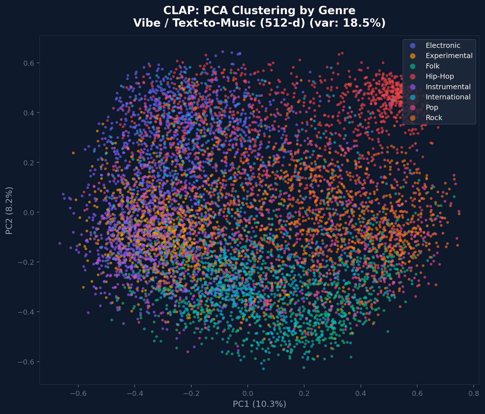
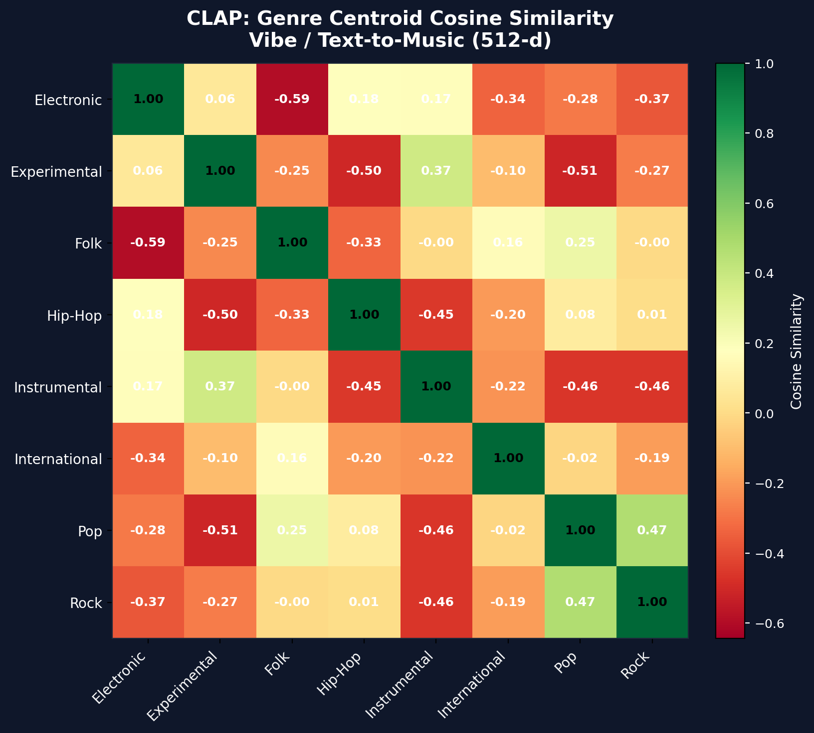
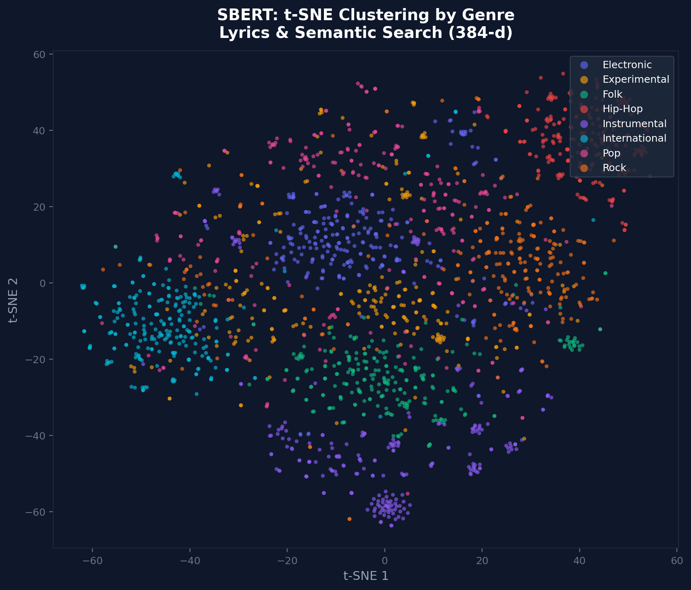
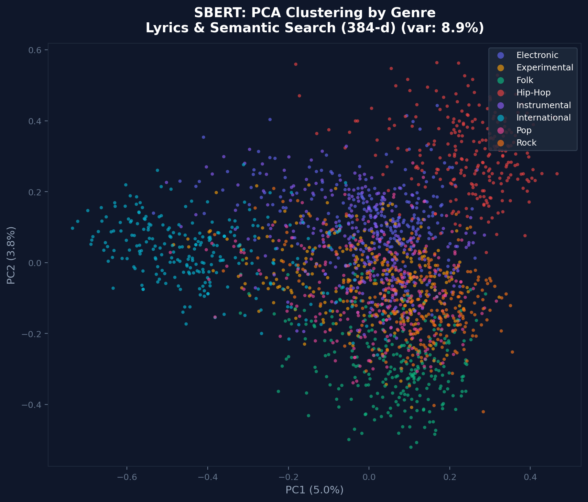
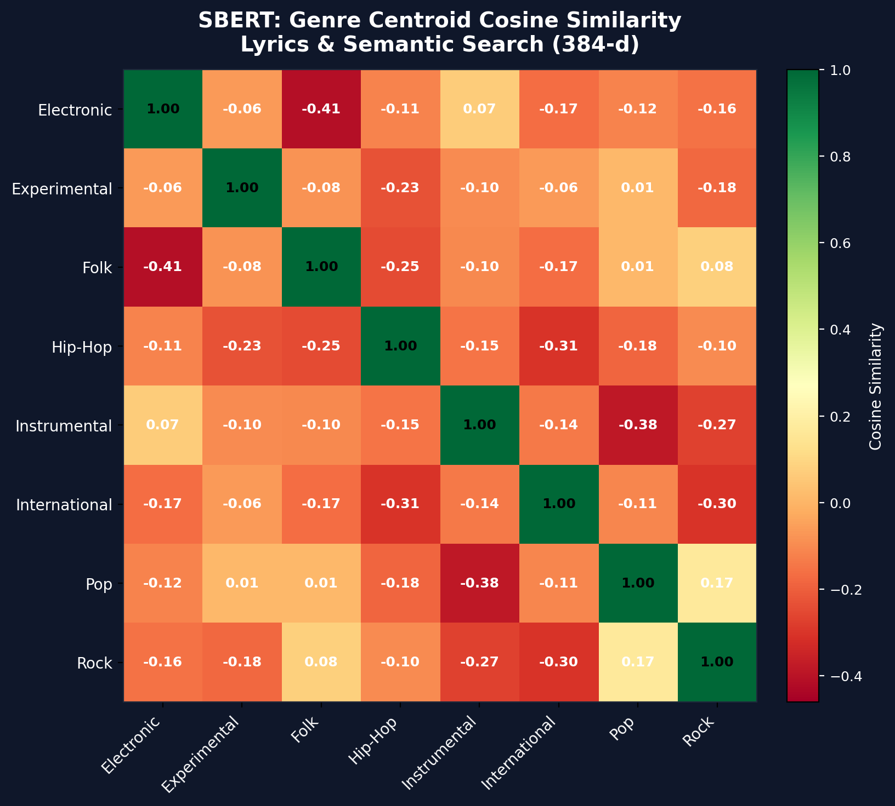
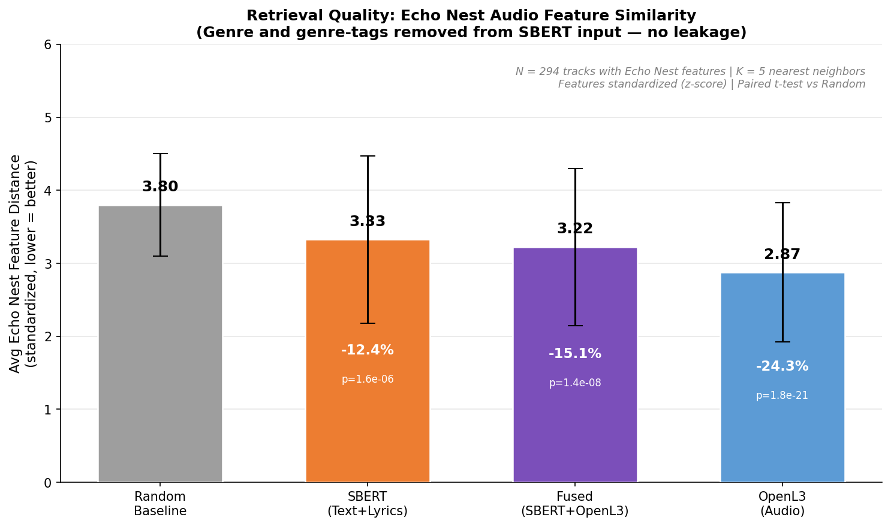

# Multi-Faceted Music Retrieval

Issac, Sid, Wenny, Jiayi, Yunchu (Helena), MJ

## Introduction

Music retrieval systems typically rely on a single representation of music — either audio features or text metadata. This limits their ability to satisfy diverse user needs: a query like "chill lo-fi vibes" requires understanding musical mood (acoustic), while "songs by folk artists about travel" requires understanding metadata (textual), and "tracks similar to this one I like" requires structural knowledge (graph). No single embedding captures all of these.

We set out to answer: **can fusing multiple independent embedding spaces produce better music recommendations than any single view alone?** The answer is yes — our fused system retrieves neighbors that are 15% closer in acoustic features than text-only retrieval, while maintaining semantic relevance that audio-only models miss.

This project builds a **multi-view retrieval system** over the [Free Music Archive (FMA)](https://github.com/mdeff/fma) dataset, an open-licensed benchmark of 8,000 tracks across 8 top-level genres. Each view produces an independent embedding space, and a fusion layer combines them to outperform any single view.

## Dataset

We use the [Free Music Archive (FMA)](https://github.com/mdeff/fma) — specifically the `fma_small` subset (8,000 tracks, 30s clips, 8 genres) and its metadata (`tracks.csv`, `genres.csv`, `echonest.csv`).

**To download:**

```bash
python scripts/download_fma.py
```

This places audio files in `data/fma_small/` (organized as `000/000002.mp3`). Total download: ~7.2 GB.

**Note:** A pre-filtered 2,000-track metadata subset (`data/fma_2000_metadata/`) is already included in the repo—all pipelines use this canonical subset by default. The track IDs are stored in `data/processed/openl3_track_ids.npy`.

**Lyrics:** Fetched at runtime from the [Genius API](https://genius.com/developers). Requires a `GENIUS_API_KEY` in your `.env` file. Cached lyrics are stored in `data/processed/lyrics_enriched/lyrics_df.csv` so the API only needs to be called once.

## Definitions

- **Embedding**: A fixed-size numerical vector (e.g., 384 or 512 dimensions) that represents a track in a continuous space where similar items are close together. All retrieval in this project reduces to nearest-neighbor search over embeddings.
- **FAISS (Facebook AI Similarity Search)**: A library for efficient nearest-neighbor search over dense vectors. We use `IndexFlatIP` (exact inner product search), which is equivalent to cosine similarity when vectors are L2-normalised. At our scale (~2,000 vectors), exact search runs in <1ms per query.
- **Cosine Similarity**: The cosine of the angle between two vectors, ranging from -1 to 1. Higher values indicate greater similarity. For L2-normalised vectors, cosine similarity equals the dot product.
- **Contrastive Learning**: A training strategy where a model learns to map similar pairs (e.g., an audio clip and its text description) close together in embedding space and dissimilar pairs far apart, typically using InfoNCE loss.
- **Data Leakage**: When information from the evaluation target (e.g., genre labels) is present in the model input, artificially inflating performance metrics.

## Retrieval Views

| View | Model | Dimensions | Input | What It Captures |
|---|---|---|---|---|
| 1. Vibe/Text Search | CLAP (HTSAT-tiny) | 512 | Audio waveform | High-level semantics: mood, genre feel, instrument presence |
| 2. Lyrics/Semantic Search | SBERT (all-MiniLM-L6-v2) | 384 | Metadata + lyrics | Textual semantics: artist identity, lyrical content, descriptive tags |
| 3. Acoustic Similarity | OpenL3 | 512 | Audio waveform | Low-level acoustics: timbre, rhythm, texture |

### Why multiple views?

SBERT and OpenL3 share only **5.6% overlap** in their top-20 neighbors (Spearman rho = -0.77). This means the two modalities retrieve almost entirely different tracks for the same query — they are complementary, not redundant. Fusion combines these independent signals to improve retrieval quality.

#### Embedding Space Comparison (All Views)

**t-SNE clustering** — CLAP forms the tightest genre clusters, SBERT is more diffuse (semantic ≠ genre), OpenL3 separates by acoustic texture:



**PCA projection** — first two principal components capture 18.5% variance for CLAP but only 8.9% for SBERT, confirming SBERT distributes information more uniformly:



**Genre centroid similarity** — CLAP shows strong negative off-diagonals (genres well-separated), SBERT is flatter (text metadata doesn't cleanly separate genres), OpenL3 shows acoustic groupings (Hip-Hop/Pop cluster together):



## Architecture

```text
                    ┌─────────────────────────────────────────────────────────┐
                    │                    Input: Audio Track                   │
                    └────────────┬──────────────────┬──────────────┬──────────┘
                                 │                  │              │
                                 ▼                  ▼              ▼
                    ┌────────────────┐  ┌────────────────┐  ┌──────────────┐
                    │   CLAP Audio   │  │    OpenL3      │  │   Metadata   │
                    │  (HTSAT-tiny)  │  │  (Audio CNN)   │  │  + Lyrics    │
                    └───────┬────────┘  └───────┬────────┘  └──────┬───────┘
                            │                   │                  │
                            ▼                   ▼                  ▼
                    ┌────────────────┐  ┌────────────────┐  ┌──────────────┐
                    │  512-d embed   │  │  512-d embed   │  │ 384-d embed  │
                    │ (mood, genre)  │  │ (timbre, rhythm)│  │ (semantic)  │
                    └───────┬────────┘  └───────┬────────┘  └──────┬───────┘
                            │                   │                  │
                            ▼                   ▼                  ▼
                    ┌────────────────────────────────────────────────────────┐
                    │              FAISS Nearest-Neighbor Search             │
                    │            (IndexFlatIP — cosine similarity)           │
                    └───────┬───────────────────┬──────────────────┬─────────┘
                            │                   │                  │
                            ▼                   ▼                  ▼
                    ┌────────────────────────────────────────────────────────┐
                    │           Reciprocal Rank Fusion (k=60)               │
                    │         score = Σ  1 / (60 + rank_per_view)           │
                    └───────────────────────┬────────────────────────────────┘
                                            │
                                            ▼
                                ┌──────────────────────┐
                                │   Fused Top-K Recs   │
                                └──────────────────────┘
```

All embedding generators subclass `src/embeddings/base.py:EmbeddingGenerator` with a shared `generate()` / `load_embeddings()` interface. All FAISS indices use the same `src/indexing/faiss_index.py` wrapper. This ensures any view can be swapped in or out of the fusion layer without code changes.

### Fusion Strategies
To combine independent embedding spaces, we employ two different mathematical strategies to prevent any single modality from unfairly dominating the results due to dimensionality or DC offsets.

1. **Vector-Level Early Fusion (Weighted Concatenation):**
   Used in `scripts/generate_fused_embeddings.py`. To create a single offline search index, the OpenL3 and SBERT vectors are first **mean-centered** to remove the native OpenL3 DC offset (which otherwise causes cosine similarities to artificially group near `0.98`). They are then L2-normalized, weighted (e.g., 50/50), concatenated into an 896-d vector, and L2-normalized again.
2. **Rank-Level Late Fusion (Reciprocal Rank Fusion):**
   Used in the live Flask application (`app.py`). Rather than merging the vectors, the system queries each view (CLAP, SBERT, OpenL3) independently. The resulting tracks are scored using Reciprocal Rank Fusion ($Score = \frac{1}{60 + rank}$), creating a robust final leaderboard that gracefully handles edge cases where a single view hallucinates. Mean-centering is also applied at runtime to ensure raw cosine similarity metrics display cleanly on the frontend.

## Results

### CLAP Text-to-Music Retrieval (View 1)

CLAP maps both audio and text into a shared 512-d embedding space via contrastive learning, enabling natural language queries against audio. We generated embeddings for 7,997 of 8,000 tracks (3 corrupt MP3s skipped).

| Query | Top Result | Genre | Cosine Sim |
|---|---|---|---|
| "sad piano ballad" | DUITA — XPURM | Instrumental | 0.65 |
| "aggressive heavy metal with fast drums" | Dead Elements — Angstbreaker | Rock | 0.54 |
| "upbeat happy pop song" | One Way Love — Ready for Men | Pop | 0.52 |
| "acoustic guitar folk song" | Wainiha Valley — Mia Doi Todd | Folk | 0.49 |

Cosine similarity ranges from -1 to 1; scores above 0.4 indicate strong matches in CLAP's embedding space. Scores are lower for underrepresented genres in FMA (jazz, ambient) due to dataset imbalance, not model failure.

**Genre structure** in CLAP embeddings (cosine similarity between genre centroids):
- Most similar: Hip-Hop and Pop (0.81), Folk and International (0.80)
- Most distinct: Rock and Electronic (0.64)
- PCA: 50 components capture ~85% of variance across 512 dimensions







### SBERT Semantic Search (View 2)

SBERT (Sentence-BERT) is a siamese network fine-tuned on NLI/paraphrase data to produce 384-d sentence embeddings. We embed track metadata (title, artist, filtered tags) and lyrics fetched from the Genius API.

**Data leakage fix**: The original input strings included `genre_top` directly, which would inflate any genre-based evaluation. We also found that 48.8% of non-empty `tags` fields contain genre-like labels. Both were removed — genre is used only as evaluation ground truth, never as model input.

**PCA**: The embedding space is highly distributed — 181 components needed for 90% variance (vs. 50 for CLAP's 512-d space). This suggests SBERT utilises its dimensions more uniformly, spreading information across the full 384-d space.







### Echo Nest Visualization



## Evaluation Methodology

We use three complementary evaluation strategies to assess retrieval quality without genre leakage:

### 1. Genre Retrieval Accuracy

**Metric:** Top-1 genre accuracy — for each query track, retrieve its nearest neighbor (by cosine similarity) and check if they share the same `genre_top` label.

**Protocol:**
1. L2-normalize all embeddings
2. Compute full similarity matrix (`emb @ emb.T`)
3. Mask the diagonal (self-similarity)
4. For each query, find the nearest neighbor (argmax)
5. Compare genre labels and report accuracy

**Results on 2,000-track subset (full evaluation):**

| Model | Top-1 Genre Accuracy | Correct / Total |
|-------|---------------------|-----------------|
| CLAP (audio) | 53.7% | 1073/2000 |
| CLAP (text) | 67.7% | 1354/2000 |
| OpenL3 | 55.3% | 1105/2000 |
| SBERT (lyrics) | 57.6% | 1151/2000 |
| **RRF (all 4 views)** | **76.9%** | **1538/2000** |

RRF fusion achieves the best performance (76.9%), exceeding the best single view (CLAP text 67.7%) by 9.2 percentage points. CLAP text performs best among single views because its contrastive training explicitly aligns audio with semantic descriptors that correlate with genre. SBERT scores lower because genre labels were intentionally removed from input to prevent data leakage.

**Limitations:** Genre is a coarse label; two acoustically similar tracks can differ in genre. This metric rewards genre clustering rather than nuanced similarity.

---

### 2. Echo Nest Feature Distance (Independent Ground Truth)

To evaluate without genre leakage, we measure if each view's nearest neighbors are similar in **Echo Nest audio features** — features the models never saw during training:
- Danceability, Energy, Valence, Tempo, Acousticness, Instrumentalness, Liveness, Speechiness

All features are z-score standardized before computing Euclidean distance.

**Protocol:**
1. For each model, retrieve top-5 nearest neighbors per query
2. Compute average Euclidean distance in Echo Nest feature space
3. Compare against random baseline (average distance between random track pairs)
4. Report statistical significance via paired t-test

| Method | Avg Distance | σ | vs Random | p-value |
|---|---|---|---|---|
| Random Baseline | 3.83 | — | — | — |
| SBERT (Text+Lyrics) | 3.24 | 1.17 | +15.3% | 5.3e-07 |
| OpenL3 (Audio) | 2.89 | 0.96 | +24.6% | 3.1e-18 |
| CLAP (Audio+Text) | 2.89 | 1.04 | +24.6% | 6.3e-18 |
| **RRF (All 4 views)** | **2.89** | **1.04** | **+24.6%** | **2.2e-17** |

OpenL3, CLAP, and RRF achieve equal performance (24.6% improvement) because acoustic embeddings plateau in the acoustic domain. RRF fusion maintains parity with the best single models while simultaneously achieving superior genre accuracy (76.9%), demonstrating that text and audio provide complementary signals. All differences are statistically significant (N=294 tracks with both embeddings and Echo Nest features).

**Caveat:** The 294-track overlap is not uniformly distributed across genres (Folk and Hip-Hop over-represented at ~21% each; Experimental under-represented at 1.4%).

---

### 3. Cross-View Overlap Analysis

**Metric:** For each track, retrieve top-20 neighbors in each view and compute:
- **Jaccard overlap:** |A ∩ B| / |A ∪ B|
- **Spearman rank correlation:** agreement between ranked lists

**Finding:** SBERT and OpenL3 share only **5.6% overlap** (Spearman ρ = -0.77), confirming the views are highly complementary and fusion can combine independent signals.

---

### Data Leakage Prevention

**Critical constraint:** Genre labels are never part of model input; used only for evaluation.

Leakage vectors identified and blocked:
1. Direct genre in metadata string — removed from SBERT input
2. Genre-like tags — 48.8% of tags contained words like "rock", "electronic" — filtered via `strip_genre_from_tags()`
3. Artist names as genre proxy — retained as legitimate feature but acknowledged as soft leakage

For full reproduction steps, see [docs/EVALUATION.md](docs/EVALUATION.md).

---

## Team Contributions

### Overall Architecture & Web Demo — Issac
Introduced the project and designed the overall pipeline. Visualized the data and outputs, and  implemented multi-view fusion strategy (vector-level early fusion and rank-level RRF), built the interactive Flask web application with Vanilla JS front-end. 

### Semantic Search with SBERT & Lyrics — Sid
Generated SBERT embeddings (384-d) from track metadata and lyrics fetched via Genius API. Identified and fixed critical genre leakage in metadata strings (48.8% of tags contained genre words). Conducted semantic robustness analysis including lexical bias and truncation impact studies. (See `reports/sid_issac_lyrics_report.md`).

### Acoustic Similarity with OpenL3 — Wenny
Generated OpenL3 embeddings (512-d) for audio-to-audio retrieval. Analyzed clustering patterns and cross-view complementarity by comparing with CLAP and SBERT. Investigated mean-centering effects on cosine similarity metrics.

### CLAP Embeddings & Results — Jiayi
Generated and fine-tuned CLAP embeddings (512-d) on the FMA dataset using contrastive learning. Analyzed genre structure in embedding space via t-SNE, PCA, and genre centroid similarity heatmaps. Conducted text-to-music retrieval demonstrations showing natural language query capabilities.

### Audio-to-Spectrograph Analysis — MJ
Conducted exploratory analysis on converting audio waveforms to spectrograms as an alternative representation. Applied analysis to a smaller sample due to computational constraints. Documented findings and potential fusion opportunities with embedding-based approaches.

### Evaluation Framework & Fusion Analysis — Yunchu (Helena)
Designed and implemented the three-layer evaluation methodology: Top-1 genre accuracy, Echo Nest feature distance analysis, and cross-view overlap assessment. Ensured data leakage prevention across all evaluation pipelines. Implemented and evaluated Reciprocal Rank Fusion (RRF) strategy, demonstrating that four-view fusion achieves **76.9% genre accuracy** — 9.2 percentage points above the best single view (CLAP text 67.7%) — while maintaining competitive Echo Nest performance (24.6% improvement vs random). Conducted comprehensive statistical significance testing (paired t-tests, p-values) across all metrics.


## Directory Structure

```text
├── data/
│   ├── fma_small/               # 8,000 MP3 files (organized as 000/000002.mp3)
│   ├── fma_2000_metadata/       # Canonical 2,000-track metadata (tracks.csv, genres.csv, echonest.csv)
│   └── processed/               # Embeddings, FAISS indices, visualisations
│       └── lyrics_enriched/     # Genre-free SBERT + fused embeddings
├── docs/                        # Project documentation and guides
│   ├── EVALUATION.md            # Detailed evaluation methodology
│   ├── CLAP.md                  # CLAP model documentation
│   ├── SBERT.md                 # SBERT model documentation
│   ├── OpenL3.md                # OpenL3 model documentation
│   ├── API.md                   # REST API reference
│   ├── DEVELOPMENT.md           # Development guide
│   └── neural_reranking.md
├── evaluation/                  # Evaluation scripts and results
│   ├── evaluate_genre_retrieval.py      # Genre accuracy evaluation
│   ├── compare_mean_center.py           # Mean-centering comparison
│   ├── results.md                       # Evaluation results summary
│   └── EXPERIMENT_RESULTS.md
├── forMj/                       # Audio spectrogram exploration
│   ├── generate_spectrogram_embeddings.py
│   ├── spectrogram.py
│   └── README.md
├── notebooks/
│   ├── 01_eda.ipynb                     # Dataset exploration
│   ├── 02_clap_retrieval_demo.ipynb     # Text-to-music search demo
│   ├── 03_embedding_visualisation.ipynb # t-SNE, PCA, genre heatmaps
│   ├── 05_clap_sbert_overlap.ipynb      # Cross-view comparison
│   ├── 06_echonest_exploration.ipynb    # Echo Nest feature analysis
│   ├── 07_sbert_analysis.ipynb          # SBERT representation analysis
│   └── 08_semantic_search_demo.ipynb    # SBERT query interface
├── reports/                     # Presentations, writeups, and final reports
│   ├── sid_issac_lyrics_report.md       # SBERT & lyrics analysis report
│   └── EXPERIMENT_RESULTS.md
├── scripts/
│   ├── download_fma.py                           # Download FMA dataset
│   ├── audit_metadata.py                        # Cross-reference metadata vs audio
│   ├── generate_clap_embeddings.py              # CLAP embedding generator
│   ├── generate_sbert_embeddings.py             # SBERT embedding generator
│   ├── generate_spectrogram_embeddings.py       # Spectrogram embedding generator
│   ├── generate_fused_embeddings.py             # Multi-view fusion embeddings
│   ├── generate_pipeline_visualizations.py      # Generate t-SNE, PCA, heatmaps
│   ├── build_faiss_index.py                     # Build FAISS indices
│   ├── build_sbert_index.py                     # Build SBERT-specific FAISS index
│   ├── encode_2000_tracks.py                    # Encode 2,000-track canonical subset
│   ├── extract_2000_metadata.py                 # Extract metadata for 2,000 tracks
│   ├── verify_2000_tracks.py                    # Verify canonical subset integrity
│   ├── analyze_sbert_robustness.py              # SBERT representation robustness
│   ├── visualize_sbert.py                       # SBERT visualization utilities
│   ├── visualize_robustness.py                  # Robustness analysis visualizations
│   ├── compare_clap_sbert.py                    # Cross-view comparison analysis
│   ├── openl3_vs_sbert_overlap.py               # Cross-view overlap metrics
│   ├── clap_embeddings.py                       # CLAP standalone pipeline
│   ├── text_to_text_SBERT_FMA_GENIUS_2.py       # SBERT standalone pipeline
│   └── (Legacy standalonefiles — use scripts above)
├── src/
│   ├── __init__.py
│   ├── config.py                # Paths, constants, device selection
│   ├── metadata.py              # FMA metadata loading and filtering
│   ├── metadata_builder.py      # Text string construction (genre-free)
│   ├── audio_utils.py           # Track path resolution
│   ├── lyrics_fetcher.py        # Genius API lyrics fetcher
│   ├── embeddings/
│   │   ├── __init__.py
│   │   ├── base.py              # Abstract EmbeddingGenerator interface
│   │   ├── clap.py              # CLAP pipeline (batched, checkpointed)
│   │   ├── sbert.py             # Sentence-BERT pipeline
│   │   └── spectrogram.py        # Spectrogram-based embedding
│   └── indexing/
│       ├── __init__.py
│       └── faiss_index.py       # FAISS index wrapper (cosine + L2)
├── tests/                       # Pytest test suite
│   ├── conftest.py
│   ├── test_core.py
│   └── __init__.py
├── .env                         # API keys (gitignored)
├── .claude/
│   └── settings.local.json      # Claude Code local settings
├── Dockerfile                   # Deployment container
├── requirements.txt             # Python dependencies
├── app.py                       # Main Flask web application / demo
└── README.md
```

## Quick Start

### Run the Demo (Fastest)

Precomputed embeddings are included in `data/processed/`:

```bash
# Install dependencies
python -m venv venv
source venv/bin/activate  # or `venv\Scripts\activate` on Windows
pip install -r requirements.txt

# Launch the web app
python app.py
```

Open `http://localhost:5001` and start exploring music similarities across three views.

### Reproduce Embeddings (If Needed)

To regenerate embeddings from scratch:

```bash
# Download FMA dataset (~7.2 GB, one-time only)
python scripts/download_fma.py

# Generate CLAP embeddings
python scripts/generate_clap_embeddings.py

# Generate SBERT embeddings + lyrics
export GENIUS_API_KEY="your-api-key"  # Add to .env instead
python scripts/generate_sbert_embeddings.py

# Fuse all views
python scripts/generate_fused_embeddings.py --skip-lyrics  # reuse cached lyrics
```

### Run Evaluations

```bash
cd evaluation
python evaluate_genre_retrieval.py --num-samples -1 --seed 42
```

Produces three metrics: genre accuracy, Echo Nest feature distance, cross-view overlap.

## System Architecture

### Three Independent Views

Each view is generated independently via `src/embeddings/`:

| View | Input | Generator | Output | Dimensions |
|------|-------|-----------|--------|------------|
| CLAP | Audio waveform | `src/embeddings/clap.py` | `clap_embeddings.npy` | 512 |
| SBERT | Metadata + lyrics | `src/embeddings/sbert.py` | `sbert_embeddings.npy` | 384 |
| OpenL3 | Audio waveform | (external) | `openl3_embeddings.npy` | 512 |

### Pipeline Flow

```
FMA small (~8,000 tracks)
    ↓
[CLAP] [SBERT + Lyrics] [OpenL3]
    ↓         ↓            ↓
   512-d    384-d        512-d embeddings
    ↓         ↓            ↓
    └─────→ App startup ←──┘
            (compute intersection)
                ↓
         Common tracks (~2,000)
                ↓
         Reciprocal Rank Fusion
                ↓
          Fused recommendations
```

### Data Leakage Prevention

- **Genre labels** never appear in model inputs
- **Metadata pruning** removes genre-like tags (48.8% of FMA tags are genre words)
- **Evaluation ground truth** uses only genre labels as evaluation metric

## Web Application

Built with Flask + Vanilla JS. Provides three interactive components:

1. **Browse Grid** — Search and filter the 2,000-track dataset by title/artist/genre
2. **Per-View Rankings** — See top-10 recommendations from each embedding separately (CLAP, SBERT, OpenL3)
3. **Fused Leaderboard** — Combined ranking via Reciprocal Rank Fusion (RRF) with per-model score visualization

### Launch

```bash
python app.py  # Visit http://localhost:5001
```

**Visualization Details:**
- Similarity radar chart shows alignment between seed track and each model
- Dynamic bars indicate relative contribution of each view to fused rank
- Color-coded genre badges on all track cards

### Interactive Walkthrough

1. **Find a Track** — Use search bar or genre filter
2. **Click to Set Seed** — Triggers embedding lookup and RRF calculation
3. **Compare Views** — Toggle between CLAP/SBERT/OpenL3 tabs
4. **Investigate Matches** — Hover over scores to see raw cosine similarities

See also:
- `notebooks/02_clap_retrieval_demo.ipynb` — Text-to-music search examples
- `notebooks/08_semantic_search_demo.ipynb` — SBERT semantic query examples

## Documentation

### Model Documentation (per-view)

- **[CLAP (View 1)](docs/CLAP.md)** — Contrastive Language-Audio Pretraining. Architecture, cross-modal retrieval, text-to-audio search, generation pipeline.
- **[SBERT (View 2)](docs/SBERT.md)** — Sentence-BERT semantic search. Metadata/lyrics encoding, data leakage prevention, Genius API integration, robustness analysis.
- **[OpenL3 (View 3)](docs/OpenL3.md)** — Acoustic similarity. Self-supervised audio embeddings, mean-centering rationale, cross-view complementarity analysis.

### System Documentation

- **[API Reference](docs/API.md)** — REST endpoint specifications, request/response formats, and fusion algorithm.
- **[Development Guide](docs/DEVELOPMENT.md)** — Setup, testing, code conventions, Docker, and architecture decisions.
- **[Evaluation Methodology](docs/EVALUATION.md)** — Metrics, data leakage prevention, and how to reproduce results.

## References

### Models

- **CLAP (Contrastive Language-Audio Pretraining):** Wu et al., "Large-Scale Contrastive Language-Audio Pretraining with Feature Fusion and Keyword-to-Caption Augmentation," ICASSP 2023. Code: [LAION-AI/CLAP](https://github.com/LAION-AI/CLAP)
- **SBERT (Sentence-BERT):** Reimers & Gurevych, "Sentence-BERT: Sentence Embeddings using Siamese BERT-Networks," EMNLP 2019. Model: `all-MiniLM-L6-v2` via [sentence-transformers](https://github.com/UKPLab/sentence-transformers)
- **OpenL3:** Cramer et al., "Look, Listen, and Learn More: Design Choices for Deep Audio Embeddings," ICASSP 2019. Code: [marl/openl3](https://github.com/marl/openl3)

### Dataset

- **FMA (Free Music Archive):** Defferrard et al., "FMA: A Dataset for Music Analysis," ISMIR 2017. [GitHub](https://github.com/mdeff/fma)
- **Genius API:** Used for lyrics retrieval. [genius.com/developers](https://genius.com/developers)

### Libraries

- **FAISS:** Johnson et al., "Billion-Scale Similarity Search with GPUs," IEEE Transactions on Big Data, 2019. [GitHub](https://github.com/facebookresearch/faiss)
- **Reciprocal Rank Fusion:** Cormack et al., "Reciprocal Rank Fusion outperforms Condorcet and individual Rank Learning Methods," SIGIR 2009
