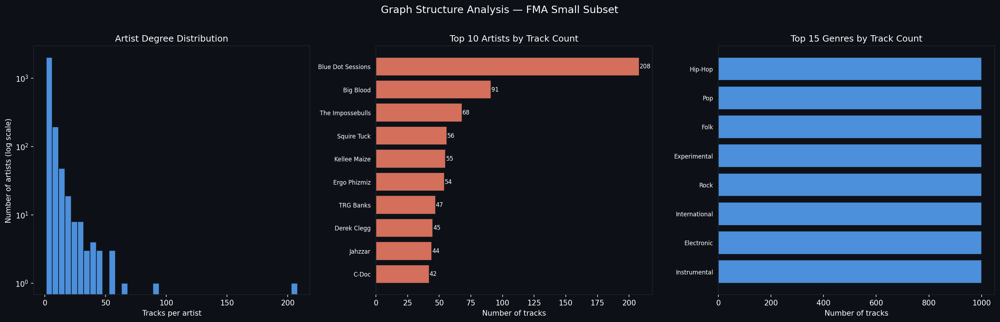
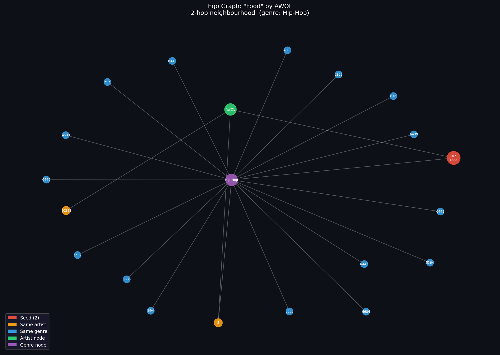
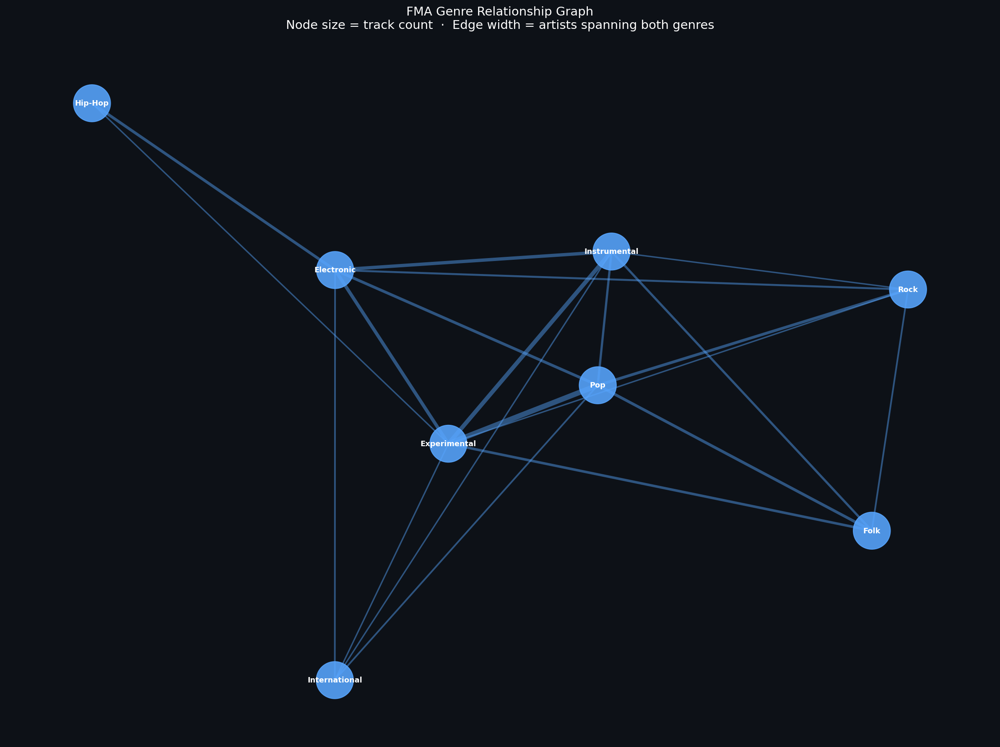
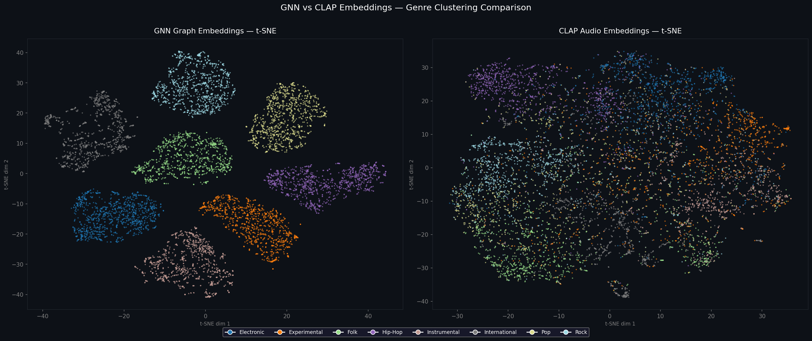

# Role 3: Graph-based Recommendation — Issac

## Goal

Build a **heterogeneous graph** from FMA metadata and learn structural embeddings that encode relationships between tracks, artists, and genres. This enables recommendation-style retrieval based on **connectivity** rather than raw audio or text content.

## Background

The FMA metadata gives us a natural graph: each track belongs to an artist, and each track is tagged with one or more genres. We can model this as a heterogeneous graph with multiple node types (track, artist, genre) and edge types (track→artist, track→genre, co-genre). A GNN trained on this graph will learn embeddings that cluster tracks not just by sound, but by who made them and what they connect to.

## Your Tasks

1. **Construct the heterogeneous graph**
   - Load `tracks.csv` and `genres.csv` using `src/metadata.py`
   - Define node types:
     - `track`: 8,000 nodes (the small subset)
     - `artist`: unique artist IDs from metadata
     - `genre`: up to 163 genre nodes
   - Define edge types:
     - `track → artist` (each track has one artist)
     - `track → genre` (each track has a top genre, and optionally sub-genres)
     - `artist → genre` (derived from track edges)
     - Optionally: `track ↔ track` co-genre edges (tracks sharing the same top genre)
   - Build using PyTorch Geometric's `HeteroData`

2. **Add node features**
   - For `track` nodes: use CLAP embeddings as initial features (`data/processed/clap_embeddings.npy`)
   - For `genre` nodes: one-hot or learnable embeddings
   - For `artist` nodes: mean-pool their track CLAP embeddings as initial features

3. **Train a GNN**
   - Use `HeteroConv` with `SAGEConv` or `GATConv` layers
   - Task options (choose one or both):
     - **Link prediction**: predict hidden track→genre edges (train/val/test split)
     - **Node classification**: predict top-genre label for each track
   - Save the trained model to `models/gnn_checkpoint.pt`

4. **Extract track embeddings**
   - After training, extract the GNN's learned track node embeddings
   - Save to `data/processed/gnn_embeddings.npy` + `gnn_track_ids.npy`
   - Build a FAISS index: `data/processed/gnn_faiss.index`

5. **Analysis & Visualizations**
   We have already generated a comprehensive suite of baseline analyses and GNN visualizations to validate our model. These can be found in `data/processed/` and `role3_graph_issac/`:

   **Initial Exploratory Data Analysis (Baseline)**
   
   *Distribution and Variance of raw 512D CLAP acoustic embeddings:*
   
   

   *Acoustic distances between different genres based purely on raw audio features:*
   

   *2D projections of the raw CLAP embeddings demonstrating that acoustic features alone are insufficient for genre separation:*
   
   

   **GNN Graph Analysis**
   
   *Structural connectivity of our constructed graph:*
   
   
   *Local graph neighborhood for a specific seed track used for node recommendations:*
   

   *Macro-level connections between genres based on artist/track relationships:*
   

   *The definitive validation plot demonstrating our GNN's performance. It shows a side-by-side comparison of the raw CLAP projections vs. the GNN embeddings:*
   

## Setup

```bash
# PyTorch Geometric installation is version-specific
# Check https://pytorch-geometric.readthedocs.io/en/latest/install/installation.html
# For torch 2.8.0 on CPU/Mac:
pip install torch-geometric
pip install torch-scatter torch-sparse -f https://data.pyg.org/whl/torch-2.8.0+cpu.html
```

## Key Files

| Path | Purpose |
|---|---|
| `src/metadata.py` | Load tracks.csv, genres.csv |
| `src/config.py` | Paths and constants |
| `data/fma_metadata/tracks.csv` | Track → artist, genre links |
| `data/fma_metadata/genres.csv` | Genre taxonomy |
| `data/processed/clap_embeddings.npy` | Use as initial track node features |
| `data/processed/clap_track_ids.npy` | Track ID alignment |

## Deliverables

- [ ] `src/graph/build_graph.py` — constructs the HeteroData object
- [ ] `src/graph/gnn_model.py` — GNN architecture
- [ ] `src/graph/train.py` — training loop
- [ ] `data/processed/gnn_embeddings.npy`
- [ ] `data/processed/gnn_faiss.index`
- [ ] `models/gnn_checkpoint.pt`
- [ ] Notebook: graph construction and visualisation
- [ ] Notebook: graph-based recommendation demo
